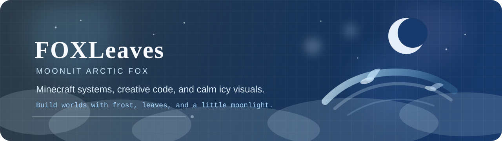

  
   
   
  
  
  

## 你好，我是 FOXLeaves

> ～小狐狸一位～

## 代表作 / Featured Project

  

- 这是一个更有戏剧张力的 Minecraft 玩法和系统。

## GitHub 数据 / Stats

  
  

## 留个脚印 / Find Me

- Website: [coldmouse.cn](https://coldmouse.cn)
- Bilibili: [space.bilibili.com/400694722](https://space.bilibili.com/400694722)
- YouTube: [@ArcticFox-leaves](https://www.youtube.com/@ArcticFox-leaves)

---

  Building small worlds with frost, leaves, and moonlight.

